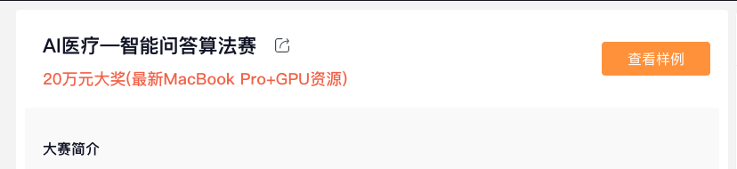
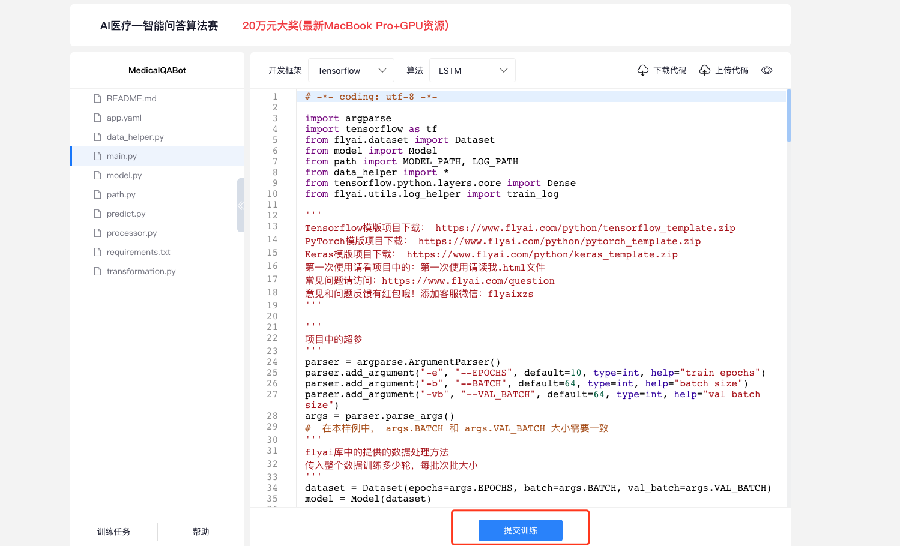
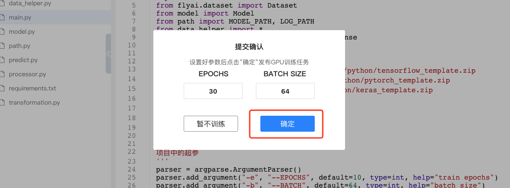
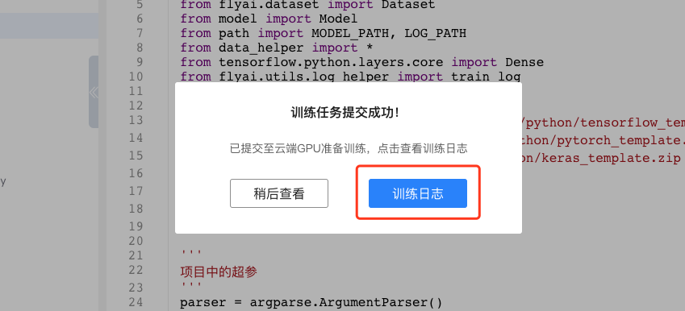

# 新手必读

### 关于FlyAI

FlyAI是为AI开发者提供的深度学习算法竞赛平台。

FlyAI为开发者提供免费的云端GPU（Tesla P40）计算资源用于参赛并且每个赛题都会提供由算法团队实现的样例代码Baseline

通过迭代模型准确率超过赛题标准得分线，人人都可以实时获得奖金哦！ 挑战者，都在FlyAI～

### 如何参赛？

* 怎么报名参赛？

**选择自己擅长的领域，点击首页的赛题列表进入到赛题详情页**

**点击“报名参赛“按钮即可报名成功！**

### 如何提交？

**每个赛题都提供了样例代码，并且FlyAI支持在线上提交代码使用云端GPU进行训练，点击“查看样例“进入到在线提交代码页面。**

**点击“提交训练“就可以将当前的代码提交到云端GPU进行训练了，通过FlyAI微信服务平台可以接收训练的结果通知。**

**默认训练参数，直接点击确定即可提交训练。**

#### 可以在线查看实时的训练日志。

**现在我们的参赛介绍完了！开始自己尝试提交吧～**

