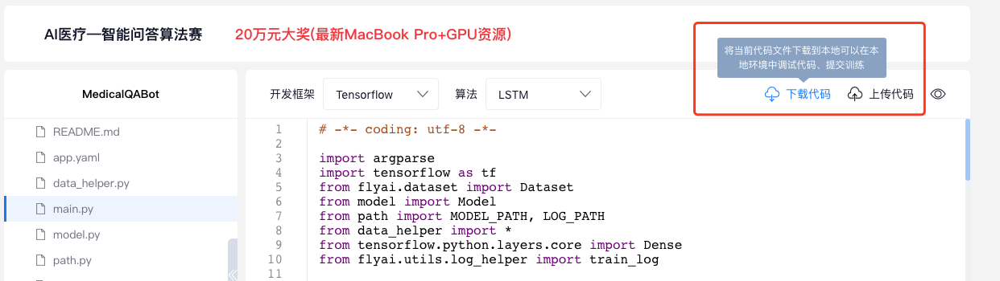
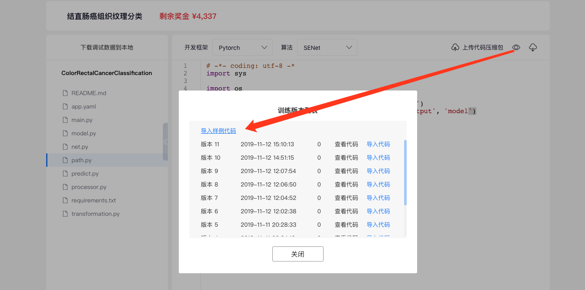
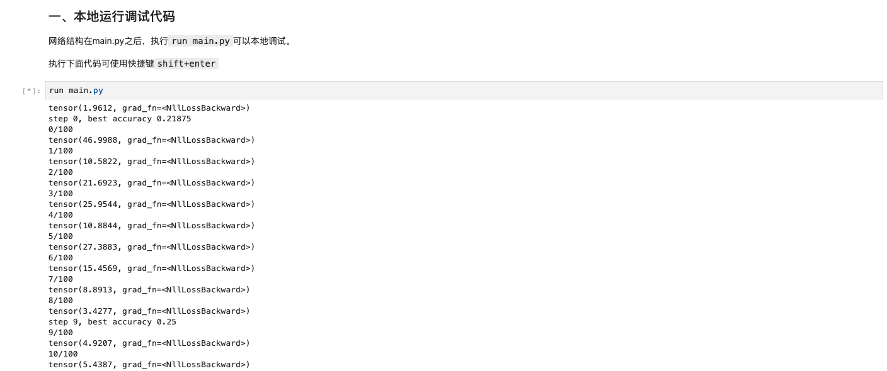
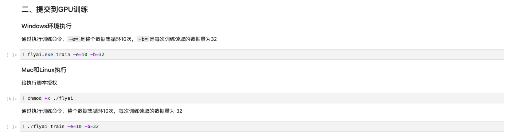
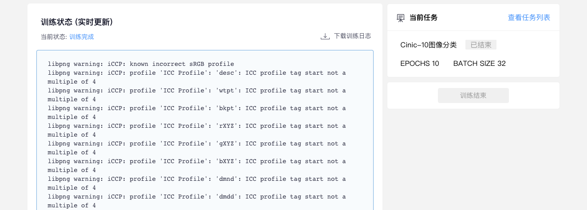

# 使用Jupyter调试代码，云端GPU训练

### 1.下载代码包到本地

**请在代码编辑页点击"下载代码"按钮，将当前代码下载到本地** 



注：如果想下载赛题样例代码可以点击查看版本，并重新导入样例代码后执行下载操作：



### 2.启动 FlyAI 本地调试环境（Jupyter）

#### Windows客户端

* 解压下载的样例代码包，并打开“flyai.exe“程序
* 首次打开需要使用FlyAI账号登录
* 登录成功后可以选择"使用jupyter调试"启动代码调试环境
* 还可以选择"下载调试数据"查看调试数据

查看Windows客户端使用教程视频：

[https://dataset.flyai.com/flyai\_course-localdebugging.mp4](https://dataset.flyai.com/flyai_course-localdebugging.mp4)

#### Windows 终端

* 下载并解压代码包
* 打开运行，输入 cmd ,打开终端

```text
Win + R 输入 cmd 打开终端
```

* 使用终端进入到项目的根目录下,如：

```text
cd 代码包根目录
# 快捷方式：在终端输入"cd"后空格，直接将代码包文件拖拽到终端窗口中
```

* 执行flyai脚本命令开启代码调试环境

```text
flyai.exe ide
```

等待终端响应，会在本地自动调起浏览器进入Jupyter Notebook环境..

#### **Mac/Linux系统终端**

* 下载并解压代码包
* 使用终端进入到项目的根目录下,如：

```text
cd 代码包根目录
# 快捷方式：在终端输入"cd"后空格，直接将代码包文件拖拽到终端窗口中
```

* 授权flyai

```text
chmod +x ./flyai
```

* 执行flyai脚本命令开启代码调试环境

```text
./flyai ide
```

等待终端响应，会在本地自动调起浏览器进入Jupyter Notebook环境..

### 3.体验样例代码的调试过程

#### 1）在"使用jupyter调试.ipynb"文件中运行`run main.py`进行本地调试



#### **2）将代码提交到云端使用GPU免费训练得出结果**



提交成功后将会展示训练日志的链接地址，复制链接地址在浏览器中打开可实时查看训练过程



### 4.开始实现我的代码

#### **1）首先详细阅读资料包中的 README.md 文件说明**

* **app.yaml：**是项目的配置文件，项目目录下**必须**存在这个文件，是项目运行的依赖。
* **processor.py：**处理数据的输入输出文件，把通过csv文件返回的数据，处理成能让程序识别、训练的矩阵。

  可以自己定义输入输出的方法名，在`app.yaml`中声明即可。

* **main.py：**程序入口，编写算法，训练模型的文件。在该文件中实现自己的算法。
* **model.py：**训练好模型之后可以继承`flyai.model.base`包中的`base`重写下面三个方法实现模型的保存、验证和使用。
* **predict.py：**对训练完成的模型使用和预测。
* **path.py：**可以设置数据文件、模型文件的存放路径。
* **dataset.py：**该文件在FlyAI开源库的`flyai.dataset`包中，通过`next_train_batch()`和`next_validation_batch()`方法获得`x_train` `y_train` `x_val` `y_val`数据。

#### **2）在 main.py 文件中开始实现代码，迭代模型准确率得分！**

### 5.参赛指南

* [常见问题说明](http://doc.flyai.com/question.html)
* [在MNIST数据集上达到99.26%的准确率](http://doc.flyai.com/mnist.html)


微信扫描上方二维码，加入大神圈学习成长！

