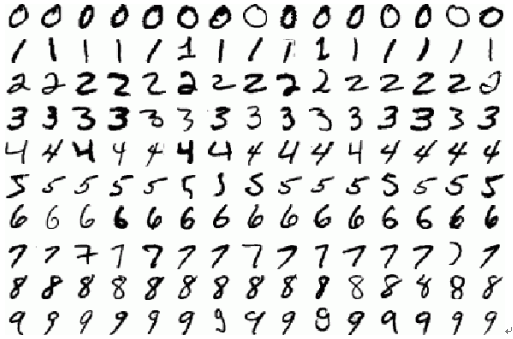
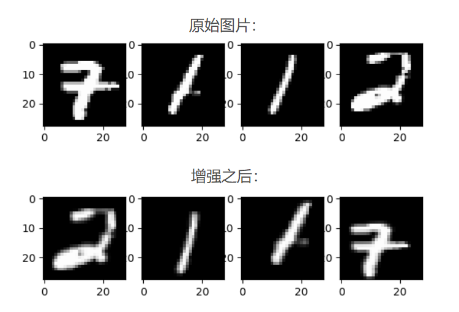
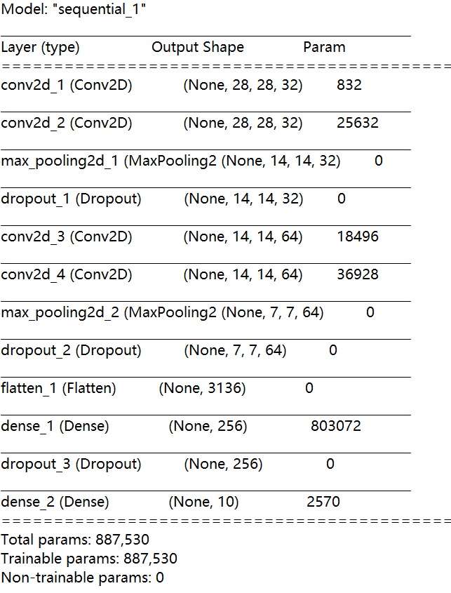
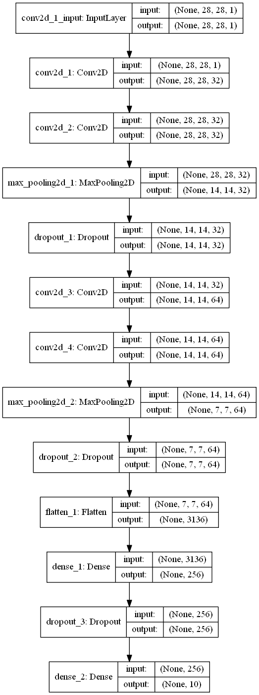
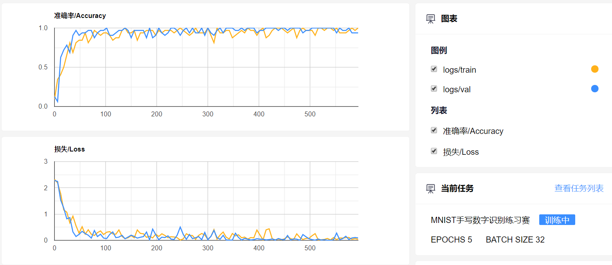

# 体验在MNIST数据集上99.26%的准确率

## 项目简介

MNIST项目基本上是深度学习初学者的入门项目，本文主要介绍使用keras框架通过构建CNN网络实现在MNIST数据集上99+的准确率。

## 数据集来源

MNIST手写数字数据集是深度学习中的经典数据集，该数据集中的数字图片是由250个不同职业的人手写绘制的，其中训练集数据一共60000张图片，测试集数据一共10000张图片。每张手写数字图片大小都是28\*28，每张图片代表的是从0到9中的每个数字。数据集官网链接： [THE MNIST DATABASE](http://yann.lecun.com/exdb/mnist/).

该数据集样例如下所示：



在[ FlyAI竞赛平台上 ](https://www.flyai.com/%20) 提供了准确率为99.26%的[超详细代码实现](https://www.flyai.com/code?data_id=MNIST)，同时我们还提供GPU资源，可以训练优化自己的MNIST模型。

## 代码实现

#### 算法流程及实现

算法流程主要分为以下四个部分进行介绍：

1. 数据加载
2. 数据增强
3. 构建网络
4. 模型训练

#### 数据加载

在FlyAI的项目中封装了Dataset类，可以实现对数据的一些基本操作，比如加载批量训练数据`next_train_batch()`和校验数据`next_validation_batch()`、获取全量数据`get_all_data()`、获取训练集数据量`get_train_length()`和获取校验集数据量`get_validation_length()`等。具体使用方法如下：

```python
# 引入Dataset类
from flyai.dataset import Dataset 
#创建Dataset类的实例
dataset = Dataset(epochs=5, batch=32) 
# dataset.get_step()返回训练总次数
for step in range(dataset.get_step()):  
    #获取一批训练数据
    x_train, y_train = dataset.next_train_batch() 
     # 获取一批校验数据
    x_val, y_val = dataset.next_validation_batch()
```

对单张图片等数据的读取是在processor.py文件中完成。实现如下：

```python
import numpy as np
import cv2
from flyai.processor.base import Base
from path import DATA_PATH
import os

class Processor(Base):
    # 读取一张图片
    def input_x(self, image_path):
        # 获取图片路径
        path = os.path.join(DATA_PATH, image_path)
        # 读取图片
        img = cv2.imread(path)
        # 将图片BGR格式转换成RGB格式
        img = cv2.cvtColor(img, cv2.COLOR_BGR2RGB)
        # 对图片进行归一化操作
        img = img / 255.0
        # 将图片转换成 [28, 28, 1]
        img = img[:, :, 0]
        img = img.reshape(28, 28, 1)
        return img
    # 读取该图片对应的标签
    def input_y(self, label): 
        # 对标签进行onehot化
        one_hot_label = np.zeros([10])  
        # 生成全0矩阵
        one_hot_label[label] = 1  
        # 相应标签位置置
        return one_hot_label
```

#### 数据增强

数据增强的作用通常是为了扩充训练数据量提高模型的泛化能力，同时通过增加了噪声数据提升模型的鲁棒性。在本项目中我们采用了比较简单的数据增强方法包括旋转、平移。实现如下：

```python
#数据增强
data_augment = ImageDataGenerator(
        # 在 [0, 指定角度] 范围内进行随机角度旋转
        rotation_range=10, 
        # 当制定一个数时，图片同时在长宽两个方向进行同等程度的放缩操作
        zoom_range=0.1,  
        # 水平位置平移
        width_shift_range=0.1,  
         # 上下位置平移
        height_shift_range=0.1, 
     )
```

为了展示数据增强的效果，我们对图像进行了可视化，完整代码如下:

```python
from keras.preprocessing.image import ImageDataGenerator
from flyai.dataset import Dataset
import matplotlib.pyplot as plt
import numpy as np
#数据增强
data_augment = ImageDataGenerator(
        # 在 [0, 指定角度] 范围内进行随机角度旋转
        rotation_range=10, 
        # 当制定一个数时，图片同时在长宽两个方向进行同等程度的放缩操作
        zoom_range=0.1,  
        # 水平位置平移
        width_shift_range=0.1,  
         # 上下位置平移
        height_shift_range=0.1, 
     )
dataset = Dataset(epochs=1, batch=4)
for _ in range(dataset.get_step()):
    x_train, y_train = dataset.next_train_batch()
    # 展示原始图片
    fig = plt.figure()
    for i in range(4):
        img = np.concatenate([x_train[i, :], x_train[i, :], x_train[i, :]], axis=-1)
        sub_img = fig.add_subplot(241 + i)
        sub_img.imshow(img)
    # 对每批图像做数据增强
    batch_gen = data_augment.flow(x_train, y=y_train, batch_size=4)
    x, y = next(batch_gen)
    # 对增强之后的图片进行展示
    for i in range(4):
        img = np.concatenate([x[i,:], x[i,:], x[i,:]], axis=-1)
        sub_img = fig.add_subplot(241 + i + 4)
        sub_img.imshow(img)
    plt.show()
```

可视化结果如图：



#### 构建网络

由于手写数字图片大小仅为28\*28，图像宽高比较小不太适合较深的网络结构。因此我们自己搭建了一个卷积神经网络，网络结构如下所示：

```python
# 构建网络
sqeue = Sequential()
# 第一个卷积层，32个卷积核，大小５x5，卷积模式SAME,激活函数relu,输入张量的大小
sqeue.add(Conv2D(filters=32, kernel_size=(5, 5), padding='Same', activation='relu',
                 input_shape=(28, 28, 1)))
sqeue.add(Conv2D(filters=32, kernel_size=(5, 5), padding='Same', activation='relu'))
# 池化层,池化核大小２x2
sqeue.add(MaxPool2D(pool_size=(2, 2)))
# 随机丢弃四分之一的网络连接，防止过拟合
sqeue.add(Dropout(0.25))
sqeue.add(Conv2D(filters=64, kernel_size=(3, 3), padding='Same', activation='relu'))
sqeue.add(Conv2D(filters=64, kernel_size=(3, 3), padding='Same', activation='relu'))
sqeue.add(MaxPool2D(pool_size=(2, 2), strides=(2, 2)))
sqeue.add(Dropout(0.25))
# 全连接层,展开操作，
sqeue.add(Flatten())
# 添加隐藏层神经元的数量和激活函数
sqeue.add(Dense(256, activation='relu'))
sqeue.add(Dropout(0.25))
# 输出层
sqeue.add(Dense(10, activation='softmax'))
sqeue.summary()
sqeue.compile(loss='categorical_crossentropy', optimizer='adam', metrics=['accuracy'])
```

运行summary\(\)方法后输出的网络结构如下图：



keras提供了keras.utils.vis\_utils模块可以对模型进行可视化操作。

```python
from keras.utils import plot_model
plot_model(sqeue, show_shapes=True, to_file='model.png')
```

模型结构图如下所示：



#### 模型训练

这里我们设置了epoch为5，batch为32，采用adam优化器来训练网络。通过调用FlyAI提供的train\_log方法可以在训练过程中实时的看到训练集和验证集的准确率及损失变化曲线。

```python
from flyai.utils.log_helper import train_log
history = sqeue.fit(x, y, batch_size=args.BATCH, 
                    verbose=0, validation_data=(x_val, y_val))
# 通过调用train_log方法可以实时看到训练集和验证集的准确率及损失变化曲线
train_log(train_loss=history.history['loss'][0], 
          train_acc=history.history['accuracy'][0],
          val_loss=history.history['val_loss'][0],
          val_acc=history.history['val_accuracy'][0])
```

训练集和验证集的准确率及损失实时变化曲线如图：



## 最终结果

通过使用自定义CNN网络结构以及数据增强的方法，在epoch为5，batch为32使用adam优化器下不断优化模型参数，最终模型在测试集的准确率达到99.26%。该项目可运行的完整[代码链接](https://www.flyai.com/code?data_id=MNIST)。

#### 参考链接：

* [MNIST手写数字识别练习赛](https://www.flyai.com/d/MNIST)
* [MNIST手写数字识别练习赛样例代码](https://www.flyai.com/code?data_id=MNIST)

